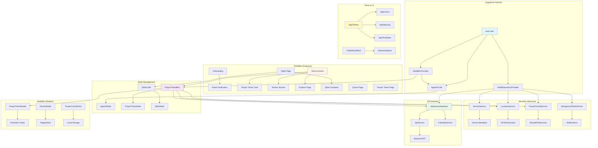

# Takvapp Mobile

Kullanıcıların günlük namaz vakitlerini takip etmesine, Kıble yönünü bulmasına ve seçilmiş İslami içerikleri keşfetmesine yardımcı olan modern Flutter uygulaması. Proje aktif olarak yeniden tasarlanıyor – yeni UI, iOS 17/18 glassmorphism desenlerinden ilham alırken tamamen çapraz platform kalıyor.

## ✨ Özellikler

- **Onboarding & E-posta Doğrulama** – Cihaz metadata'sını backend kaydı için saklayan rehberli giriş akışı
- **Ana Sayfa Dashboard** – Önbellekleme, gün doğumu/fecir/akşam kartları, hikaye carousel'i ve hızlı eylemlerle namaz vakti hero bileşeni
- **Namaz Vakitleri Motoru** – Cihaz konumunu okuyan, geohash tabanlı önbellekleme yapan ve yalnızca gerektiğinde backend API'lerini çağıran Bloc destekli iş akışı
- **Kıble Bulucu** – Canlı pusula (`flutter_compass` kullanarak), hassas konum veya sensörler kullanılamadığında yedek mantık ile
- **Kur'an Kütüphanesi (Geliştirme Aşamasında)** – Hızlı devam ve durum göstergeleriyle yeniden tasarlanmış sure listesi
- **Tasarım Sistemi** – Ekranlar arasında tutarlı stil için birleştirilmiş tema token'ları (renkler, boşluklar, tipografi)

## 🏗️ Mimari Diyagram



## 🛠️ Teknoloji Yığını

- **Flutter** 3.24+
- **Dart** 3.9
- **State Management:** `flutter_bloc` (BLoC pattern)
- **Konum Servisleri:** `geolocator`, `geocoding`, `flutter_compass`
- **Kalıcı Önbellek:** `shared_preferences`
- **Ağ İşlemleri:** `dio`
- **Kod Üretimi:** `json_serializable`, `build_runner`
- **Fontlar:** `google_fonts` (Poppins ailesi)
- **SVG Desteği:** `flutter_svg`
- **Bildirimler:** `flutter_local_notifications`

## 📁 Proje Yapısı

```
takvapp_Mobile/
├── android/                    # Android platform projesi
├── ios/                        # iOS platform projesi
├── lib/
│   ├── core/                   # Çekirdek modüller
│   │   ├── api/                # API servisleri ve arayüzler
│   │   ├── models/             # Veri modelleri
│   │   ├── services/           # İş mantığı servisleri
│   │   ├── theme/              # Tema ve stil tanımları
│   │   └── utils/              # Yardımcı fonksiyonlar
│   └── features/               # Özellik bazlı modüller
│       ├── app_init/           # Uygulama başlatma
│       ├── home/               # Ana sayfa
│       ├── onboarding/         # İlk kullanım akışı
│       ├── prayer_times/       # Namaz vakitleri
│       ├── qibla/              # Kıble bulucu
│       └── quran/              # Kur'an sayfası
├── assets/                     # Görseller, fontlar ve statik dosyalar
│   ├── fonts/                 # Poppins font ailesi
│   └── images/                # Uygulama görselleri
├── docs/                       # Dokümantasyon
├── analysis_options.yaml       # Lint kuralları
├── pubspec.yaml               # Bağımlılıklar ve Flutter metadata
└── README.md                  # Bu dosya
```

## 🚀 Başlangıç

### Gereksinimler

1. **Flutter SDK 3.24 veya üzeri** (`flutter doctor` komutu sorun bildirmemeli)
2. **iOS için:** Xcode 15+ / **Android için:** Android Studio ve en son SDK araçları

### Kurulum

1. **Bağımlılıkları yükle**
   ```bash
   flutter pub get
   ```

2. **Uygulamayı çalıştır**
   ```bash
   flutter run
   ```
   Belirli bir cihaz için: `flutter run -d <device_id>`

3. **Kod üretimi (gerekirse)**
   ```bash
   flutter pub run build_runner build --delete-conflicting-outputs
   ```

## 🧪 Test & Kalite

- **Statik analiz:** `flutter analyze`
- **Widget/Birim testleri:** `flutter test` (test dosyaları `test/` klasörüne eklenebilir)
- **Lint kuralları:** `analysis_options.yaml` dosyasındaki kurallara uyun

## 📦 Ortamlar & API'ler

- Uygulama şu anda backend geliştirme aşamasındayken sahte API servisi (`FakeApiService`) kullanıyor. Gerçek servise geçmek için `lib/main.dart` dosyasındaki `useFakeApi` değişkenini `false` yapın.
- Namaz vakitleri ve Kıble pusulası için konum izinleri gereklidir. iOS kullanıcıları en iyi deneyim için **Hassas Konum** özelliğini etkinleştirmelidir.

## 🔄 Veri Akışı

1. **Uygulama Başlatma:** `AppInitCubit` cihaz bilgilerini toplar ve backend'e kaydeder
2. **Konum İzni:** Kullanıcıdan konum izni istenir
3. **Namaz Vakitleri:** `PrayerTimesBloc` konumu alır, geohash ile önbelleği kontrol eder
4. **API Çağrısı:** Önbellekte yoksa veya süresi dolmuşsa backend API'sine istek atılır
5. **Önbellekleme:** Gelen veriler `PrayerCacheService` ile `SharedPreferences`'a kaydedilir
6. **UI Güncelleme:** Bloc state değişiklikleri ile UI otomatik güncellenir

## 🎨 Tasarım Sistemi

Uygulama iOS 17/18 glassmorphism desenlerinden ilham alan modern bir tasarım sistemine sahiptir:

- **Renkler:** `AppColors` sınıfında tanımlı tema renkleri
- **Boşluklar:** `AppSpacing` ile tutarlı padding/margin değerleri
- **Tipografi:** Poppins font ailesi ile `AppTextStyles`
- **Efektler:** `FluidGlassEffect` widget'ı ile cam efekti

## 🤝 Katkıda Bulunma

1. Repository'yi fork edin ve clone'layın
2. `main` branch'inden yeni bir branch oluşturun: `git checkout -b feat/yeni-ozellik`
3. Değişikliklerinizi yapın, mümkünse test ekleyin, `flutter analyze` ve `flutter test` çalıştırın
4. Conventional commit mesajları kullanın: `feat: …`, `fix: …`, `refactor: …` vb.
5. `main` branch'ine karşı bir Pull Request açın ve değişikliklerinizi açıklayın

## 📄 Lisans

Bu proje şu anda özel olup yalnızca Takvapp ekibine dağıtılmaktadır. Proje halka açık sürüme hazır olduğunda lisans koşulları tanımlanacaktır.

## 🙌 Teşekkürler

- Tasarım yönü iOS 17/18 cam bileşenlerinden ve Takvapp ürün tasarım ekibi tarafından sağlanan iç mock-up'lardan ilham almıştır
- Backend API spesifikasyonu Takvapp mimari ekibi tarafından hazırlanmıştır – entegrasyon kancaları kod tabanında mevcuttur

---

Sorularınız veya geri bildirimleriniz için bir issue açın veya Takvapp workspace'inde @FethiOmur ile iletişime geçin.
